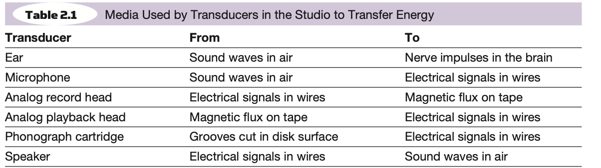
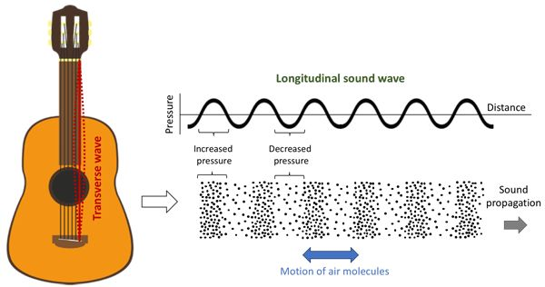
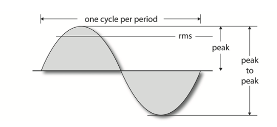
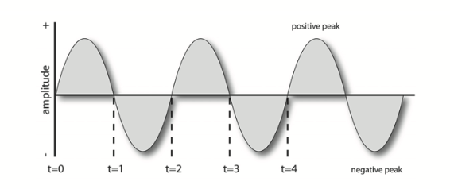
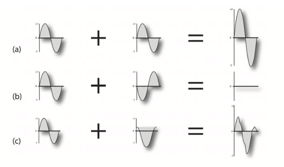
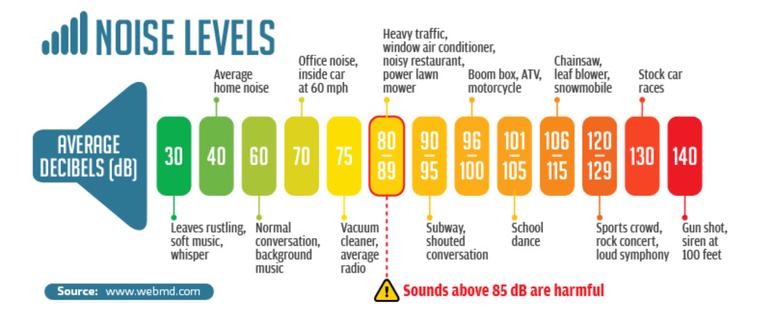
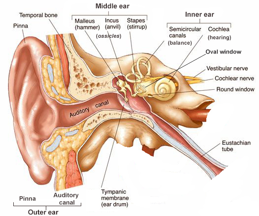
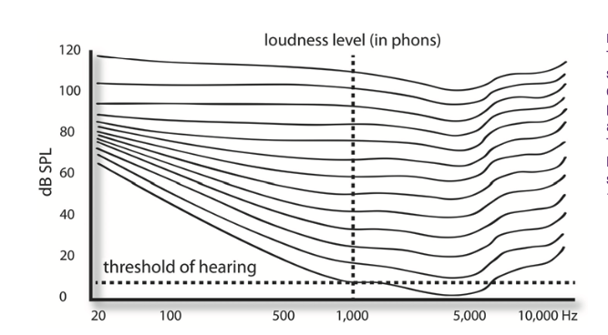

+++
title = "Sound and hearing"
outputs = ["Reveal"]
[reveal_hugo]
margin = 0.2
+++

## Sound and hearing

### What you'll learn
- How amplitude, frequency, phase, and harmonics shape sound
- How the ear turns pressure waves into perception
- How psychoacoustics affects what we hear
- How these ideas guide recording and mixing decisions
- How to protect your hearing throughout your career

{}
Everything we cover this semester, including recording, EQ, synthesis, and hearing safety, rests on these fundamentals. Make that connection clear at the start.
{}

---

<!--
## Sound areas

- The basics of sound
- The characteristics of the ear
- How a sound stimulates the ear
- The psychoacoustics of hearing

---

The Transducer

device -> energy conversion -> resulting energy

-->

{}
Every transducer converts energy from one form into another.

For example, a guitar string vibrates. The body amplifies that vibration and transfers it to the air as pressure waves that we hear as sound.

Ask: What devices could be considered transducers?

- Microphones
- Loudspeakers
- Pickups

{}

---

## Sound begins with changing air pressure

{}
Sound reaches the ear as rapid changes in atmospheric pressure called sound-pressure waves. This is the same kind of pressure measured by a weather station, but sound produces changes that are much smaller and faster than a barometer can show.

A balloon popping creates a sudden pressure change. Most sounds create a repeating pattern of smaller changes.

{}

---

{}
Any vibrating object, such as a vocal fold or guitar string, compresses and expands the surrounding air. These alternating regions of high and low pressure travel away from the source.

This diagram shows how sound moves through air. In audio production, we usually represent those pressure changes as a waveform. A waveform lets us see level over time and, with simple periodic sounds, estimate frequency.
{}

---

<!--
## Understanding Amplitude

### Key Concepts
- Amplitude measures the strength or intensity of a sound wave.
- It directly relates to perceived loudness.

{}
Introduce the concept of amplitude here. Stress that amplitude is a fundamental aspect of how we perceive sound, and it directly affects the loudness we hear.
{}

---
-->

## Amplitude

{}
Amplitude is the waveform's distance above or below its centerline. Greater displacement means a larger pressure change, a stronger electrical signal, or more physical movement in the medium.
{}

---

## Greater amplitude usually sounds louder

- Compare the level of a whisper with the level of a shout.
- Try the [interactive amplitude demo](https://contrib.pbslearningmedia.org/WGBH/buac20/buac20-int-wavesamplitude/index.html).
- Watch your recording levels. Too much amplitude can cause clipping and distortion.

{}
Run the demo and ask students to describe what changes. Connect their observations to recording levels in Reaper.
{}

---

## Frequency describes how fast a wave repeats

- Frequency measures the number of cycles a wave completes each second.
- We measure it in hertz (Hz).
- Frequency strongly influences perceived pitch.

{}
Frequency is the rate at which a vibration or signal repeats. One hertz equals one cycle per second.

The A above middle C is commonly tuned to 440 Hz.
{}

---

## Frequency shapes pitch and the balance of a mix

- Compare a low bass note with a high whistle.
- Try the [interactive frequency demo](https://contrib.pbslearningmedia.org/WGBH/buac20/buac20-int-wavesfreq/index.html).
- When sounds occupy the same frequency range, they can compete for attention in a mix.

{}
Run the demo. This prepares students for the EQ unit, where they will learn to manage sounds that compete in the same frequency range.
{}

---

## Phase describes timing between waves

- Phase describes the timing relationship between two waves.
- When similar waves fall out of phase, some frequencies may weaken or cancel.
- Hear it in this [phase-cancellation demonstration](https://youtu.be/bc1Z1ck9hKQ).

{}
The demo makes phase cancellation audible. We will return to this problem when recording one source with multiple microphones.
{}

---

<!--
[Random phases - square and sawtooth](https://tomasboril.cz/fourierseries3d/en/)

---
-->

## Harmonics give sounds their character

- Most musical sounds contain a fundamental frequency plus higher partials.
- The pattern and strength of those partials help define timbre.
- This is why a guitar and piano sound different even when they play the same note.
- Explore the [Fourier Series 3D demonstration](https://tomasboril.cz/fourierseries3d/en/).
  
{}
Most real-world sounds are far more complex than a sine wave.

We distinguish instruments partly by the frequencies that accompany the fundamental. These frequencies are called partials. Partials above the fundamental are upper partials, or overtones. When those overtones occur at whole-number multiples of the fundamental, they are harmonics.

Harmonics also form the basis of synthesis.
{}

---

# Decibels describe level on a logarithmic scale

{}
We measure sound-pressure level, or SPL, in decibels (dB). The scale is logarithmic, so a small numerical increase can represent a large increase in sound energy.
{}

---

# The ear turns pressure changes into neural signals

{}
- The pinna collects sound and directs it into the ear canal.
- Pressure waves vibrate the eardrum and become mechanical motion.
- The middle-ear bones transfer that motion to the cochlea.
- Inside the cochlea, hair cells respond to different frequencies and send signals to the brain.
{}

---

<!--
## Introduction to Psychoacoustics

- **What Is It?** Psychoacoustics explores how our brain interprets sound.
- **Key Concepts:** Pitch perception, loudness perception, and spatial hearing.

{}
Introduce the concept of psychoacoustics and explain why it's important in audio production. Stress that this field helps us understand how listeners perceive the sounds we create.
{}

---
-->

## One sound can hide another

- One sound can make another harder to hear, especially when they occupy nearby frequencies.
- Kick drum and bass guitar often mask each other.
- MP3 and AAC encoders use masking models to remove sounds that listeners are unlikely to notice.

Try the [auditory masking experiment](https://auditoryneuroscience.com/index.php/scene_analysis/masking_tone_noise/).

{}
Play a steady low-frequency tone, then add a second tone slightly above it.
Ask whether students hear both tones equally. One may seem to fade or disappear.
Connect the effect to mixing decisions and perceptual audio coding.
{}

---

## The brain can create a beat that is not in either ear

- Send a slightly different frequency to each ear and the listener may perceive a third, pulsing beat.
- For example, 440 Hz in the left ear and 446 Hz in the right can produce a perceived 6 Hz beat.
- The effect shows that hearing depends on how the brain combines information from both ears.

Try the [binaural beat generator](https://mynoise.net/NoiseMachines/binauralBrainwaveGenerator.php/) with headphones.

{}
Use headphones. The demo shows that auditory perception emerges in the brain, not only in the ears. Connect it to spatial hearing and pitch perception.
{}

---

## Our sensitivity changes across the frequency range

{}
This graph shows equal-loudness contours, often called Fletcher-Munson curves.

What it shows:
- The x-axis shows frequency in Hz, from bass to treble.
- The y-axis shows sound-pressure level in dB SPL.
- Each curve connects tones that listeners judge to be equally loud.
- The curve labels are phons, referenced to the perceived loudness of a 1,000 Hz tone.

Why there are multiple curves:
- Each curve uses a different reference level at 1,000 Hz.
- A 40-phon contour uses a 1,000 Hz tone at 40 dB SPL as its reference.
- An 80-phon contour uses a 1,000 Hz tone at 80 dB SPL.
- Listeners adjusted tones at other frequencies until they sounded equally loud.

What students should notice:
- At low levels, bass and extreme treble need more energy to sound as loud as the midrange.
- At higher levels, the curves flatten and our response becomes more even across the spectrum.
- This helps explain why quiet music can sound thin and why older stereos included a loudness control to boost lows and highs at low playback levels.
{}

---

## Playback level changes the tonal balance we perceive

- Our ears are most sensitive to the midrange.
- Bass must be physically louder than midrange to sound equally loud.
- At low monitoring levels, bass and treble often seem weaker.

Try the [equal-loudness experiment](https://www.phys.unsw.edu.au/jw/hearing.html).

{}
Play tones of different frequencies at the same level and ask which sounds louder. Midrange tones will usually stand out. Use the result to explain why engineers check mixes at several monitoring levels.
{}

---



## Safe listening time shrinks as level rises

- NIOSH recommends no more than **85 dBA averaged over 8 hours**.
- Each 3 dB increase doubles the sound energy and halves the recommended exposure time.
- 88 dBA: 4 hours. 94 dBA: 1 hour. 100 dBA: 15 minutes.
- Loud concerts can approach 100 dBA. Earbuds at full volume can reach dangerous levels too.

Sources: [NIOSH noise exposure limits](https://www.cdc.gov/niosh/noise/prevent/understand.html) · [WHO safe listening](https://www.who.int/news-room/questions-and-answers/item/deafness-and-hearing-loss-safe-listening)

{}
The 85 dBA figure is NIOSH's recommended exposure limit, based on a 3 dB exchange rate. OSHA's legal standard is less protective at 90 dBA with a 5 dB exchange rate. Ask the class: How many hours did you spend in headphones yesterday? At what level?
{}

---



## Muffled hearing and ringing are warning signs

- Muffled hearing after a loud event is a **temporary threshold shift**.
- Ringing or buzzing is **tinnitus**.
- Both signal that the auditory system has been stressed.
- The symptoms may fade, but repeated exposure can cause permanent damage.
- In humans, damaged cochlear hair cells do not regrow.

{}
A temporary threshold shift may clear within hours or days, but it is a warning, not a free pass. Repeated exposure can lead to permanent hearing loss, and tinnitus can become chronic. Many engineers and musicians live with damage they acquired early in their careers.
{}

---



## Protect your hearing before it becomes a problem

- Measure sound levels instead of guessing. The **NIOSH Sound Level Meter** app is free for iOS.
- Keep personal-listening volume low enough to hear comfortably without strain.
- Choose a comfortable monitoring level and resist turning it up as your ears tire.
- Bring earplugs to shows. Foam plugs protect well; musician's plugs preserve more of the frequency balance.

{}
If students use iOS, have them install the NIOSH Sound Level Meter app and measure the room. Return to consistent monitoring levels during the mixing unit. A stable reference protects hearing and improves judgment because louder playback often seems more impressive. Musician's earplugs aim for more even attenuation across the spectrum, so they preserve the character of the music better than typical foam plugs.
{}
