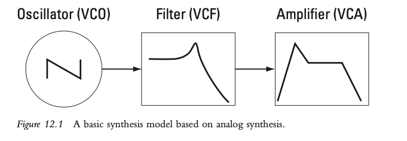
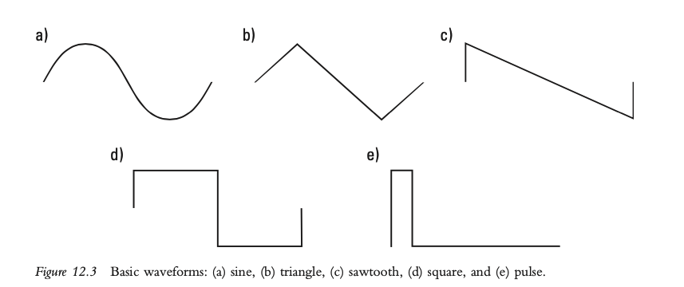
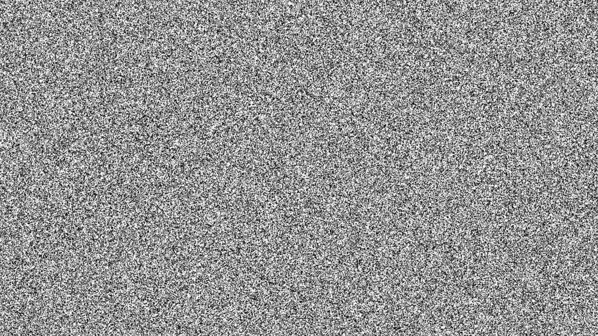
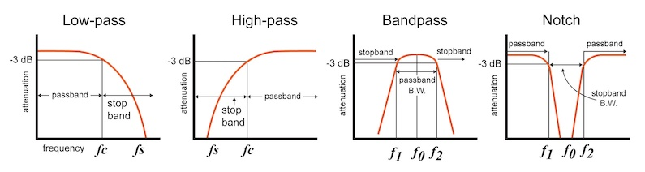
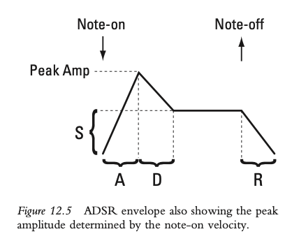
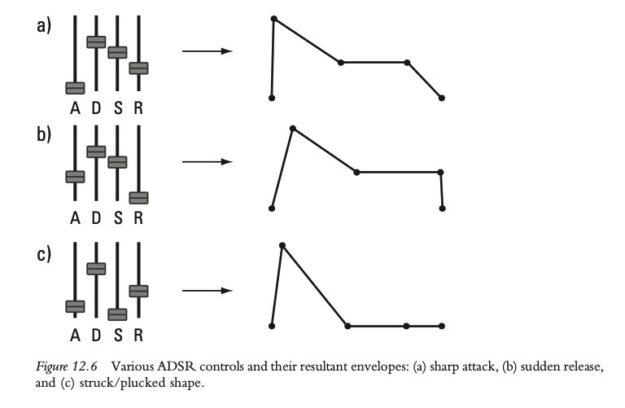

+++
title = "Electronic Sound Production"
outputs = ["Reveal"]
[reveal_hugo]
# show_notes = "separate-page"
+++

# Electronic sound production – synthesis

{}
Purpose of today

- Bridge from MIDI editing, sequencing, and sampling into synthesis as a core way of making sound.
- Equip you with the mental model of signal flow so you can patch any soft synth, modular, or hardware.

What synthesis means

- Synthesis generates sound from the ground up by following a procedure or algorithm.
- Example mindset: instead of searching for the perfect sample, we design the sound’s building blocks and their relationships.

Guiding questions

- What produces the raw tone?
- What shapes its spectrum over time?
- What shapes its loudness and articulation over time?
- What controls those changes?
{}

---

## Case study: recreating a trumpet

- Goal
  - Recreate the gist of a trumpet tone without sampling one.
- High level approach
  - Identify partials (harmonics) in a recorded trumpet note.
  - Use several oscillators to match partial frequencies and relative levels.
  - Introduce slight detune and amplitude modulation for realism.

{}
Show spectrogram in Sonic Visualizer 

Additive path

- Start with sine oscillators set to harmonic ratios 1f, 2f, 3f, 4f, etc.
- Amplitude for each partial typically decreases roughly as 1/n, then deviates by register and dynamics.
- Add a slow random or very low depth LFO to simulate breath and lip fluctuations.
- Shape the spectral brightness with a very gentle low-pass filter keyed to velocity.

Takeaway

- The method above is additive synthesis. We will contrast it with subtractive, FM, wavetable, granular, physical modeling, and sample-based methods.
{}

---

## Analog days: synthesizers in the 1960s and 1970s

- Names to know
  - Robert Moog, Donald Buchla, and contemporaries
- Key characteristics
  - Analog
  - Modular
  - Voltage controlled

{}
Analog

- Continuous electrical voltages represent audio and control signals.

Modular

- Separate hardware modules specialized for tasks: oscillators, filters, envelopes, amplifiers, mixers, sequencers.
- Patch cables define signal flow rather than a fixed internal wiring.

Voltage control

- One voltage controls another parameter. Keyboard pitch CV drives oscillator pitch; an envelope CV drives a VCA’s gain; an LFO CV sweeps a filter.
- Early controllers included keyboards, joysticks, ribbon controllers, and sequencers.

Cultural context

- Moog’s East Coast approach emphasized keyboard performance and subtractive tone shaping.
- Buchla’s West Coast approach emphasized timbre modulation, touch plates, and non–keyboard interfaces.
{}

---

## East Coast vs West Coast synthesis

- East Coast (Moog tradition)
  - Start bright, then subtract using filters.
  - Common patch: VCO → VCF → VCA with ADSR envelopes.
- West Coast (Buchla tradition)
  - Start simple, then add complexity with waveshaping and modulation.
  - Common patch: complex oscillator → waveshaper/wavefolder → low-pass gate.

{}
Why this distinction matters

- It frames two complementary mindsets: sculpting by removal vs sculpting by transformation.
- Modern instruments often blend both: wavefolding inside subtractive synths, or filters inside complex-oscillator designs.
{}

---

## Moog - show by Wendy Carlos

<iframe width="560" height="315" src="https://www.youtube.com/embed/4SBDH5uhs4Q" title="YouTube video player" frameborder="0" allow="accelerometer; autoplay; clipboard-write; encrypted-media; gyroscope; picture-in-picture" allowfullscreen></iframe>

{}
This video shows Wendy Carlos in 1970 demonstrating the Moog synthesizer, explaining how fundamental waveforms and sound-shaping tools are used to build electronic sounds from scratch. It’s a historical glimpse into the basics of analog synthesis and early electronic music technology.

Wendy Carlos is a pioneering American composer and electronic musician best known for popularizing the Moog synthesizer and for her groundbreaking 1968 album *Switched-On Bach*, which introduced synthesized classical music to a wide audience. She won three Grammy Awards for this work and helped make electronic music mainstream. Carlos also composed iconic film scores, including those for Stanley Kubrick’s *A Clockwork Orange* and *The Shining*, and Disney’s *Tron*. She is recognized both for her musical innovations and as a trailblazer for transgender visibility in the arts.

{}

---

## Buchla 200e

<iframe width="560" height="315" src="https://www.youtube.com/embed/Y7nxZdkqWpk" title="YouTube video player" frameborder="0" allow="accelerometer; autoplay; clipboard-write; encrypted-media; gyroscope; picture-in-picture" allowfullscreen></iframe>

{}
**Buchla 200e Modular Synthesizer — Brief Overview with Lecture Timestamps**

- **About the Buchla 200e:**  
  The Buchla 200e is an iconic modular synthesizer, designed by Don Buchla, that blends analog warmth with digital precision. Its modular architecture uses patch cables for free-form signal routing. Instead of a piano keyboard, it uses touch plates and X/Y pads for expressive, real-time control, making it ideal for experimental sound design and teaching core synthesis concepts.

**Key Tutorial Moments (with Timestamps):**

- **Oscillators & Frequency Modulation**  
  Demonstrates analog triangle and sine wave oscillators with cross-modulation (FM), showing flexibility in timbre creation.  
  *2:19–2:31*

- **Envelope/Dynamics Manager**  
  Covers Buchla’s quad function generators and characteristic low-pass gate, illustrating percussive amplitude envelopes and dynamic sound shaping.  
  *8:34*

- **Touch Plate Interface**  
  Shows the expressive, non-keyboard tactile input system that enables fast, precise live modulation and interaction outside the MIDI paradigm.  
  *12:07*

- **Complex Waveform Generator (261e)**  
  Explores digital and analog combined FM, symmetry, and timbral modulation for rich sound palettes.  
  *15:53*

- **Mixed Output / Additive Synthesis**  
  Demonstrates mixing oscillator outputs and additive layering for evolved timbres and sound experimentation.  
  *21:35*

- **Harmonic Oscillator**  
  Details control over individual harmonics—ideal for illustrating additive synthesis and organ-like tones—plus spectral morphing and modular patching.  
  *24:08*

{}

---

## Yamaha DX7

<iframe width="560" height="315" src="https://www.youtube.com/embed/Q1Ha0MMT0aA?start=165" title="YouTube video player" frameborder="0" allow="accelerometer; autoplay; clipboard-write; encrypted-media; gyroscope; picture-in-picture" allowfullscreen></iframe>

{}
Context

- Released 1983, early all‑digital, MIDI‑capable, and comparatively affordable.

FM essentials

- Operators are sine oscillators with independent envelopes.
- Carriers are audible; modulators change a carrier’s spectrum.
- Algorithms define how operators connect. Small changes in index or ratio have big spectral effects.

Performance impact

- Velocity and aftertouch can address operator envelopes for expressive dynamics and brightness.

Here are key moments from the **“Yamaha DX7 – The Synthesizer that Defined the ’80s”** video that would be effective for a sound synthesis lecture. Each timestamp corresponds to a topic critical for understanding FM synthesis, the DX7’s impact, and related sound examples:

- **00:43 – The Science of FM Synthesis**  
  - Introduces John Chowning’s algorithm at Stanford (1967)
  - Explains the basics of FM versus subtractive synthesis:  
    - *Subtractive*: Complex wave filtered down.
    - *FM*: One wave modulates another (e.g., violin finger modulating pitch).
  - Highlights why FM is powerful: easily emulates bells, marimbas, percussive tones.

- **02:10 – The Yamaha DX7 and FM Technology**  
  - 1983 release, first programmable FM synth.
  - Ability to create custom sounds/operators.
  - Major leap from analog to digital, paving the way for precision and versatility.

- **02:44 – Electric Piano Sound Demonstrations**  
  - Famous “E. Piano 1” preset becomes foundational in 1980s ballads (e.g., Chicago’s “Hard Habit to Break,” Whitney Houston’s “Didn’t We Almost Have It All”).

- **03:51 – Other Iconic Tones**  
  - Demonstrates DX7’s bass and fretless bass capabilities:
    - “Take My Breath Away” (Top Gun soundtrack)
    - Kenny Loggins’ “Danger Zone”
  - Harmonica emulation: Tina Turner’s “What’s Love Got to Do with It?”

- **05:06 – Ahead of Its Time: Storage and Programming**  
  - User programmability, cartridges, and software/app support.
  - Custom sound design: Preset culture and limitations—few custom patches were used.

- **05:34 – Brian Eno and Custom FM Programming**  
  - Eno’s custom patches (shown from Keyboard Magazine).
  - Use in ambient and pop music (notably “Apollo: Atmospheres and Soundtracks”).

- **06:11 – Cultural/Technical Legacy and ‘80s Revival**  
  - Summarizes how the DX7 influenced new genres and is still emulated by modern artists (La Roux, Tame Impala, The Weeknd).
  - Mentions Yamaha’s modern Montage synth as FM’s successor.

{}

---

## Basic synthesis model

{}
### Three Core Modules in Synthesis

- **Oscillator**
  - Provides a basic waveform, which determines the timbre.
  - Sets the frequency, affecting the pitch of the sound.

- **Filter**
  - Alters the spectrum or timbre of the basic waveform.
  - Can remove or boost certain frequency components.

- **Amplifier**
  - Applies an envelope to control the amplitude of the audio.
  - Affects loudness and articulation of the sound.

### Analogue Modeling Synthesis in DAWs

- **Not Actual Analogue Synthesis**
  - In Digital Audio Workstations (DAWs), the process is not true analogue synthesis but a digital emulation known as analogue modeling synthesis.

- **Voltage Control (V)**
  - The "V" often seen in module names stands for voltage control.
  - This is a nod to historical modules that were controlled by electrical voltage.

{}

---

# Pitch and timbre source: the oscillator

[Learning Synths - Oscillators](https://learningsynths.ableton.com/en/oscillators/how-synths-make-sound)

{}
Core idea

- An oscillator repeats a single cycle at a target frequency derived from MIDI note plus tuning and modulation.

Aliasing awareness

- Digital oscillators must band-limit high harmonics to avoid aliasing. Good synths use techniques like BLEP or oversampling.

Practical controls

- Coarse and fine tune for pitch, phase reset for consistency, unison voices for width, and drift for analog feel.
{}

---

## Basic Waveforms

{}
Harmonic content quick guide

- Sine contains only the fundamental; useful for pure tones or FM operators.
- Triangle contains odd harmonics dropping with the square of the harmonic number; mellow.
- Square contains odd harmonics at 1/n strength; hollow and clarinet‑like.
- Saw contains all integer harmonics at 1/n; bright and buzzy; subtractive workhorse.

Pulse width

- Varying a square’s duty cycle changes which harmonics are present and their strengths. Pulse‑width modulation produces animated chorusing.
{}

---

## Noise

{}
Noise colors

- White noise has equal energy per Hz; bright.
- Pink noise has equal energy per octave; more natural for wind and surf.
- Brownian and blue are other useful colors.

Applications

- Percussion transients, snares, cymbals, foley, and wind.
- Modulate noise level or filter cutoff with envelopes for realistic attacks and decays.
{}

---

## Timbre modification: the filter

[Learning Synths - Fitlers](https://learningsynths.ableton.com/en/filters/filters-in-the-real-world)

{}
In mixing vs synthesis

- Mix EQ is often subtle; synth filters are creative sculpting tools with pronounced character and saturation.

Common responses

- Low‑pass removes highs, high‑pass removes lows, band‑pass isolates a band, notch removes a band.

Key parameters

- Cutoff sets the transition frequency.
- Resonance emphasizes a narrow region near cutoff; high resonance can self‑oscillate and act as a sine source.
- Slope is often 12 dB or 24 dB per octave; steeper slopes sound more decisive.

Musical controls

- Envelope amount pushes the filter open on each note.
- Key tracking ties cutoff to pitch so higher notes are brighter.
- Drive adds nonlinearity for harmonically rich tone.
{}

---

# Loudness modification: the amplifier

{}
Role

- The amplifier (VCA) scales the audio signal. Its gain is controlled by envelopes, velocity, aftertouch, or other modulators.

Clarity

- Even when the oscillator is constant, the envelope at the VCA creates perceived note onsets, sustains, and releases.
{}

---

## Applying articulation with an envelope

[Learning Synths - Envelopes](https://learningsynths.ableton.com/en/envelopes/change-over-time)

{}

### Role of Envelope Generators

- **Functionality**
  - Envelope generators in synthesizers allow the amplifier to both set the maximum amplitude and shape the amplitude over the duration of a note.

### ADSR Parameters

- **Attack Time**
  - The duration it takes for the sound's amplitude to reach its maximum value.

- **Decay Time**
  - The time needed for the amplitude to drop to the sustain level.

- **Sustain Level**
  - The amplitude level that is maintained after the decay phase.
  - This level is held as long as the note is sustained.

- **Release Time**
  - Triggered by a 'note-off' message.
  - The duration it takes for the amplitude to drop to its minimum value.

{}

---

---

## Modulation sources and destinations

[Learning Synths - Modulation](https://learningsynths.ableton.com/en/lfos/change-that-repeats)

{}
Sources

- LFOs for cyclical change, envelopes for event‑based change, key tracking, velocity, aftertouch, mod wheel, random/S&H, step sequencers.

Destinations

- Pitch, pulse width, filter cutoff and resonance, oscillator mix, wavetable position, waveshaper amount, pan, effects parameters.

Best practice

- Use small amounts on multiple destinations for organic motion rather than one extreme modulation.
{}

---



## Methods of synthesis at a glance

- Subtractive
- Additive
- FM and phase modulation
- Wavetable
- Granular
- Physical modeling
- Sample‑based and hybrid

{}
Quick contrasts

- Subtractive starts rich and removes content with filters.
- Additive builds from many simple components.
- FM creates sidebands via modulation; highly efficient and expressive.
- Wavetable scans through single‑cycle waveframes for evolving tone.
- Granular rearranges micro‑snippets of audio for textures and time‑stretching.
- Physical modeling simulates the physics of instruments for realistic response.
- Modern instruments often blend methods.
{}

---

Experiment with the [Synth Playground](https://learningsynths.ableton.com/en/playground)
