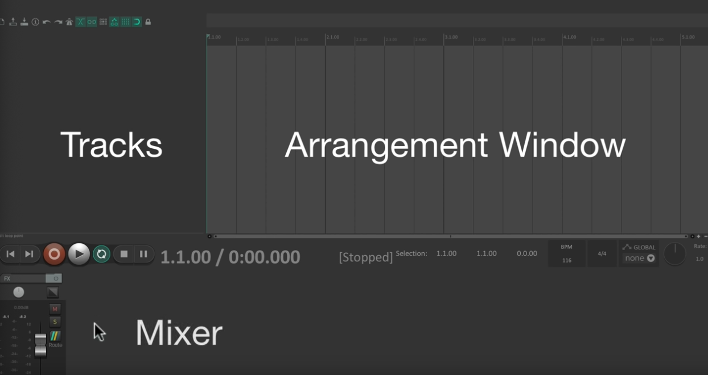
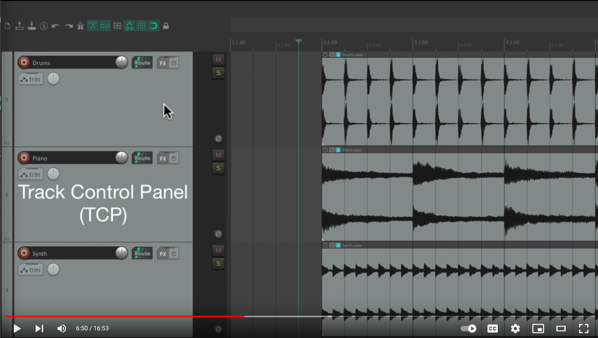

+++
title = "REAPER intro"
outputs = ["Reveal"]
[reveal_hugo]
width = 1440
height = 900
margin = 0.08
+++



## REAPER intro

---

## What is REAPER?
REAPER is a digital audio workstation (DAW) built around flexibility. You can customize its shortcuts, menus, toolbars, and mouse behavior, but its defaults are enough to get started.

{}

REAPER lets you customize key commands, menus, toolbars, and mouse behavior. Its defaults work well, so students do not need to customize anything yet.
{}

---

## Main view

Show or hide the mixer with `Cmd + M` on macOS or `Ctrl + M` on Windows.

---

## Track management

* **New track:** Press `Cmd/Ctrl + T`, or double-click below the last track.
* **Delete a track:** Select it and press `Delete`.

<video src="create-tracks.mov" loop autoplay muted controls width=470>

---

## Tracks in REAPER
- A track can hold audio, MIDI, video, or a mix of media types.
- Any track can become a folder that contains other tracks.

### Try this
> Put two media types on one track. Then create a folder that contains several tracks.

---
## Timeline customization
> Right-click on your timeline to change its units.

<video src="timeline.mov" loop autoplay muted controls width=470>

---

## You try

> Find a few sounds on [Freesound](https://freesound.org) and drag them into REAPER. Watch the track names and the way items snap to the grid. Use the magnet button if snapping is off. Press `Space` to play or stop.

---

## Working with items

* REAPER calls clips **media items**, or simply **items**.
* Drag an item to move it. Hold `Shift` while dragging to ignore snapping.
* Hold `Cmd` on macOS or `Ctrl` on Windows while dragging to copy an item.
* Drag an item's left or right edge to trim it. Select several items to trim them together.

---

## Looping and fades
* **Loop an item:** Drag its right edge past the end of the source.
* **Add a fade:** Drag the handle at an item's top corner.
* **Crossfade:** Overlap two items with auto-crossfade enabled, or select the items and a time range, then press `X`.
* Press `R` to toggle repeat playback.

---

## Fast item editing
* Press `S` to split selected items at the edit cursor.
* Press `F2` to open item properties.
* Hold `Shift` while moving an item to ignore snapping.
* Right-click an item when you need the full set of editing commands.

---

## Zoom and move around
* **Horizontal zoom:** Mouse wheel, or `-` and `+`.
* **Vertical zoom:** `Cmd + wheel` on macOS or `Ctrl + wheel` on Windows.
* **Horizontal scroll:** `Option + wheel` on macOS or `Alt + wheel` on Windows.
* Press `W` to jump to the project start. Press `End` to jump to the project end.

---

## Track control panel (TCP)

* The TCP gives you access to each track's volume, mute, solo, pan, and other parameters.

---
## Track context menu

* **Right-Click:** Right-click the track to access a contextual menu with more options.

<video src="context-menu.mov" loop autoplay muted controls width=470>

---

## The mixer

* Toggle the mixer with `Cmd + M` on macOS or `Ctrl + M` on Windows. Dock it in the main window or float it on another display.

<video src="mixer-move.mov" loop autoplay muted controls width=470>

---

## Set the project tempo

* Edit the BPM field on the right side of the transport. Click it repeatedly to tap a tempo.

<video src="tempo.mov" loop autoplay muted controls width=470>

---

## Change track size

* Drag a track edge or use `Cmd/Ctrl + wheel` to resize tracks.
* `Page Up/Down` also work on full-size keyboards.

<video src="track-height.mov" loop autoplay muted controls width=470>

---

## Explore REAPER themes

<iframe title="Examples of REAPER themes" src="https://blog.landr.com/10-best-reaper-themes/" width=820 height=500></iframe>

---

## Actions in REAPER

* Press `?` to open the Actions list.
* Search for any command, run it, or assign your own keyboard shortcut.

<video src="actions.mov" loop autoplay muted controls width=470>

---

## Additional resources

* [REAPER User Guide](https://www.reaper.fm/userguide.php)
* [REAPER Mania tutorials](https://www.youtube.com/@REAPERMania)
* [REAPER community forums](https://forum.cockos.com/forumdisplay.php?f=20)
