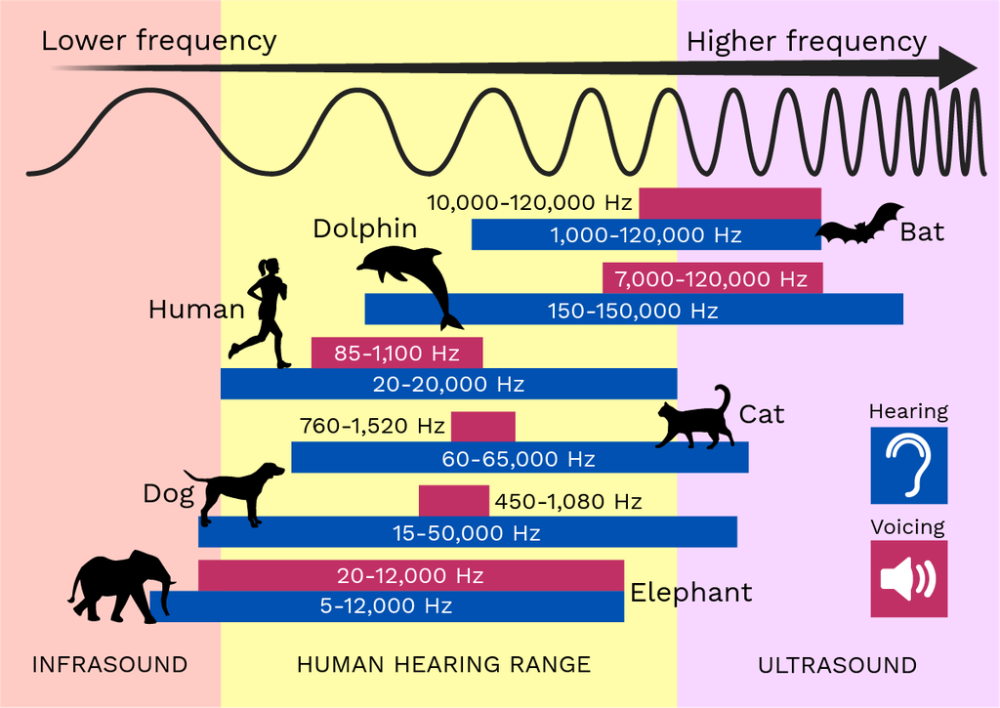

+++
title = "Mixing and EQ"
outputs = ["Reveal"]
[reveal_hugo]
+++

## Overview & Objectives

- Introduce the concept of equalization and its historical evolution.
- Compare different types of EQ tools (parametric, graphic, dynamic, shelving, etc.).
- Explain the audio frequency spectrum and how EQ interacts with it.
- Demonstrate practical techniques for tone shaping, problem solving, and creative sound design.
- Highlight EQ’s role in mixing, mastering, live performance, and sound design.

{}
Equalization (EQ) refers to the process of shaping the frequency content of an audio signal by selectively boosting or cutting specific frequencies. It is a versatile tool used in mixing and mastering to remove unwanted noise, add clarity and presence, emphasize the thump of a kick drum, or reduce muddiness caused by instruments clashing in the same frequency range. EQ allows precise adjustments across the 20 Hz – 20 kHz human hearing range, making it a core skill for audio engineers.
{}

---

## Historical Context

- **Analog beginnings**: Early equalizers were built into analogue consoles for radio and film work.
- **Graphic EQ**: Introduced in the 1950s with multiple fixed bands controlled by sliders.
- **Parametric EQ**: Invented in the 1970s, offering variable frequency, bandwidth (Q), and gain.
- **Digital EQ**: Modern DAWs include visual interfaces, dynamic automation, and linear-phase processing.

{}
Digital audio workstations now integrate EQ plugins that allow surgical sound adjustments, making room for different instruments in a mix or polishing a track before release. Avid’s Channel Strip plugin provides multiple filter nodes (low, low-mid, high-mid, high) and adjustable slopes for precise control.
{}

---

## Equalization uses

1. Tone Shaping.
2. Fixing frequency problems.
3. Balancing instruments in a mix.
4. Enhancing clarity and presence.
5. Removing unwanted noise.
6. Creating special effects.

{}

1. **Tone Shaping**: EQ is often used to shape the tonal characteristics of a sound source. You can boost or cut specific frequency ranges to make an instrument or voice sound warmer, brighter, or more natural.

2. **Fixing Frequency Problems**: Sometimes, audio recordings or live sound environments can have unwanted resonances, hums, or noise in certain frequency ranges. EQ can be used to reduce or eliminate these issues.

3. **Balancing Instruments**: In a mix, different instruments and vocals can clash in terms of frequency content. EQ helps in carving out space for each instrument and making sure they don't step on each other's sonic territory.

4. **Enhancing Clarity**: By boosting the high frequencies (treble) of a signal, you can increase clarity and presence, making it easier for the listener to hear details in the sound.

5. **Removing Unwanted Noise**: EQ can be used to roll off low frequencies that might contain rumble or wind noise. High-pass filters are a common tool for this purpose.

6. **Creating Special Effects**: Extreme EQ settings can be used creatively to achieve special effects like a telephone voice (narrow bandpass), a radio broadcast sound (filtered high frequencies), or a vintage vinyl record effect (boosting certain frequency ranges while cutting others).

{}

---

7. Correcting room acoustics.
8. Preventing feedback in live sound.
9. Matching the sound of different sources.
10.  Finalizing audio mixes (mastering).
11.  Sound design for media.
12.  DJ mixing.
13.  Optimizing live performance sound.

{}
7. **Room Correction**: In audio production, it's important to ensure that the playback environment doesn't color the sound. Room correction EQ systems can analyze the room's acoustics and apply EQ to compensate for any uneven frequency response caused by the room itself.

8. **Feedback Control**: In live sound reinforcement, EQ can be used to prevent feedback by notching out frequencies that are prone to feedback in a particular room or setup.

9. **Matched EQ**: You can use EQ to match the tonal characteristics of two different audio sources, like matching the sound of two guitar amplifiers or blending two different microphone recordings of the same instrument.

10. **Mastering**: In the final stages of audio production, mastering engineers use EQ to fine-tune the overall tonal balance of a mix and prepare it for distribution.

11. **Sound Design**: Sound designers for film, video games, and other media use EQ to shape and manipulate audio elements to create specific atmospheres, textures, and moods.

12. **DJ Mixing**: DJs use EQ on their mixers to blend songs smoothly by adjusting the bass, midrange, and treble frequencies of two tracks to match.

13. **Live Performance**: Musicians and bands often use EQ on their instruments and vocal channels to optimize their sound in a live setting, adapting to the acoustics of the venue.
{}

---

## Types of Equalizers

- **Parametric EQ** – Continuously variable frequency, gain, and bandwidth.
- **Graphic EQ** – Fixed frequency bands with sliders for broad adjustments.
- **Dynamic EQ** – EQ that responds to signal level for automated boosts/cuts.
- **Shelving EQs** – High- and low-shelf filters boost or cut all frequencies above or below a cutoff.
- **Filter Types** – High-pass, low-pass, band-pass, notch, and bell curves (peaking filters).

{}
Parametric EQ provides precise control via adjustable nodes for low, low-mid, high-mid, and high frequencies. Graphic EQ presents fixed bands and sliders—fast for broad tone shaping but less surgical. Dynamic EQ automates EQ based on input level, useful for de-essing vocals or taming harsh transients. Shelving filters uniformly boost or reduce extremes. Bell/peaking filters boost or cut around a central frequency. Notch filters remove narrow resonant hums. Band-pass filters isolate a narrow band for effects like a telephone sound.
{}

---

{}
This poster illustrates the human hearing range and the frequency spectrum, highlighting the importance of EQ in audio production.
{}

---

## Audio Frequency Spectrum

- **Sub/Low (20 Hz – 250 Hz)** – Weight and power; sub-bass and bass.
- **Low Mids (250 Hz – 500 Hz)** – Fullness of rhythm instruments and warmth of voice.
- **Mids (500 Hz – 2 kHz)** – Core harmonic content; presence and punch.
- **High Mids (2 kHz – 4 kHz)** – Clarity and definition; attack and articulation.
- **Highs (4 kHz – 20 kHz)** – Air and sparkle; cymbals, string brilliance, vocal breathiness.

{}
Understanding frequency ranges helps you decide which bands to adjust. Boosting low frequencies adds weight; reducing high frequencies can remove hiss or harshness; adjusting mids shapes the core tone.
{}

---

## EQ Controls

- **Frequency Selection** – Choose the precise frequency band to adjust.
- **Gain** – Boosts or cuts the level of a selected frequency band.
- **Quality Factor (Q)** – Controls bandwidth of the adjustment.
- **Filter Type** – High-pass, low-pass, band-pass, notch, shelving, or bell.

{}
Key controls include Gain to increase or decrease selected frequencies; Frequency to choose the band; Bandwidth/Q to set how narrow or wide the adjustment is; high-pass and low-pass filters for removing unwanted lows or highs; shelving filters for boosting or cutting extremes; and sweepable mids for targeted corrections.
{}

---

## Filter Types & Techniques

- **High-Pass Filter** – Removes low-end rumble.
- **Low-Pass Filter** – Cuts high frequencies.
- **High/Low Shelf Filters** – Boost or cut all frequencies above/below a cutoff.
- **Bell (Peaking) Filter** – Boosts or cuts around a central frequency.
- **Notch Filter** – Removes narrow resonant frequencies.
- **Band-Pass Filter** – Allows only a specific frequency range.

{}
Low-pass filters attenuate high frequencies above a cutoff point, while high-pass filters remove unwanted low-frequency rumble. Shelf filters affect everything above or below a cutoff frequency, ideal for adding brilliance or warmth. Bell curves are versatile for boosting or cutting around a chosen frequency. Notch filters surgically remove specific hums. Band-pass filters isolate a narrow band for creative effects.
{}

---

| Band | Range | Characteristics |
|---|---|---|
| Low (Sub & Bass) | 20 Hz – 250 Hz | Adds weight and warmth |
| Low Mids | 250 Hz – 500 Hz | Thickness and body |
| Mids | 500 Hz – 2 kHz | Core harmonic content |
| High Mids | 2 kHz – 4 kHz | Clarity and articulation |
| Highs | 4 kHz – 20 kHz | Air and sparkle |

{}
These ranges are guidelines rather than strict rules. For example, boosting 80–100 Hz can add punch to a kick drum, while boosting 3–5 kHz helps vocals cut through a mix. Cutting 600 Hz may reduce mid-range muddiness. Always adjust by ear and in context.
{}

---

## Guess the Range

- I'll play a sound clip, and you guess which frequency range was boosted or cut.
- You don't need to specify exact frequencies, just the general band (e.g., Low, Low Mids, Mids, High Mids, High).

---

## Additional Resources

---

**Frequency Cheatsheet** 

<iframe src="musicfrequencycheatsheet.pdf" style="width:100%; height: 700px"></iframe>

---

**Reaper Effects Guide** 

<iframe src="https://dlz.reaper.fm/userguide/REAPEREffectsGuide2021.pdf#page=17" style="width:100%; height: 700px"></iframe>

---

## Wrap-Up & Takeaways

- EQ is a foundational tool for shaping, balancing, and enhancing audio.
- Understanding frequency bands and filter types is essential.
- Subtractive EQ should generally precede additive EQ.
- Creative EQ techniques can evoke environments and textures.
- Practice and critical listening are key to mastering EQ.

{}
Encourage students to experiment with EQ settings on different material. Emphasize that effective EQ is about balance and subtlety: each adjustment should serve the greater goal of improving the overall sonic landscape.
{}
