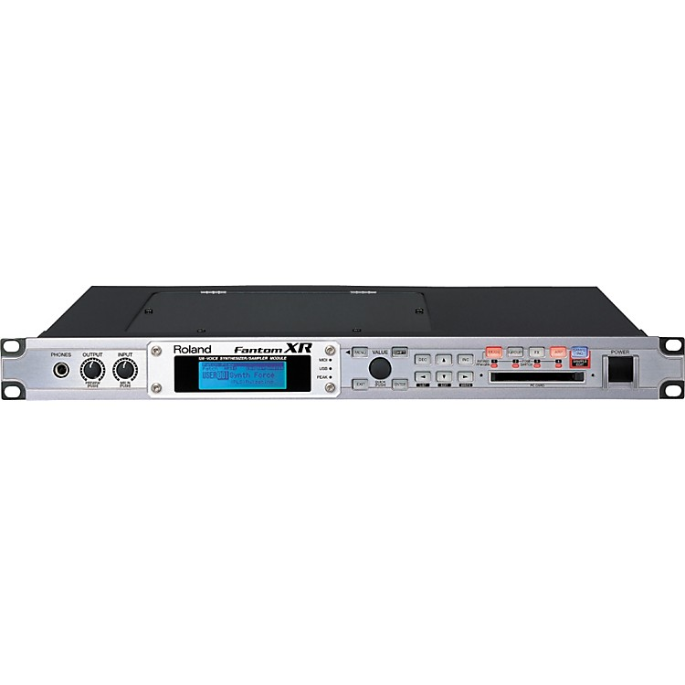

+++
title = "MIDI"
outputs = ["Reveal"]
[reveal_hugo]
# show_notes = "separate-page"  # uncomment if you want a separate notes page
+++

{}

Spoken notes

* Goal for today: give students a historically grounded but future-facing understanding of MIDI—what it is, how it travels, the messages it carries, and where it’s going (MPE and MIDI 2.0).
* We’ll also call out practical workflows they can try in a DAW and on hardware in the lab.
* Emphasize: MIDI is data about performance, not audio. It’s tiny, flexible, and designed for interoperability.

References
MIDI 1.0 and history overview; see specific refs on later slides.

{}

---

# What MIDI is

* Musical Instrument Digital Interface
* Proposed in 1981, announced in 1982, first public demo in January 1983
* Transmits performance data, not audio

{}

Spoken notes

* Define MIDI carefully: it’s a protocol and a family of specs for representing and exchanging musical performance information between instruments, computers, and controllers.
* Timeline: proposal in 1981, industry alignment in 1982, and the first public demonstration at Winter NAMM 1983.
* Contrast MIDI data vs audio: note numbers and velocities vs waveforms. This is why you can edit MIDI so freely in a DAW.

References
MIDI history and first demo: The MIDI Association history chapters and photos of Prophet-600 ↔ Jupiter-6 at Winter NAMM 1983. ([MIDI.org][1])

{}

---

# What MIDI sends

* Channel voice messages: note on/off with velocity, poly key pressure, channel pressure, control change, program change, pitch bend
* Common controller (CC) mappings: CC1 modulation, CC7 volume, CC10 pan, CC11 expression, CC64 sustain
* System messages: clock, start/stop/continue, time code, machine control

{}

Spoken notes

* Channel voice messages are the bread and butter: they target a specific channel and carry musical intent. Demonstrate with a controller and a soft synth: send note on/off, wiggle the mod wheel (CC1), ride expression (CC11).
* Pitch bend is high-resolution and centered at 0x2000; devices set bend range.
* System messages don’t target a specific channel; they handle synchronization and transport control in multi-device rigs.

References
Message categories and CC examples: About MIDI Part 3 and Expanded MIDI 1.0 Messages List. ([MIDI.org][2])

{}

---

# Sync options

* MIDI Clock for tempo/beat sync (24 pulses per quarter note)
* MIDI Time Code for absolute time in hours:minutes:seconds:frames
* MIDI Machine Control for transport commands

{}

Spoken notes

* Clock is beat-based; show how a DAW can be master and a drum machine follows tempo. Mention the 24 ppqn convention the spec uses for clock.
* MIDI Time Code (MTC) encodes SMPTE-style absolute time; used when locking to video or linear media.
* MIDI Machine Control (MMC) sends transport: play, stop, record, locate. Good for controlling tape machines historically; today useful for remote transport in hybrid rigs.

References
MTC overview; MMC overview; ppqn discussion. ([MIDI.org][3])

{}

---

## How Midi Connects: Physical Layers

  

    <ul>
      <li>5-pin DIN current-loop at 31.25 kbaud (legacy, still common)</li>
      <li>USB-MIDI for computers, tablets, phones</li>
      <li>3.5 mm TRS MIDI (Type A/B) standardized in 2018</li>
      <li>Bluetooth LE MIDI for wireless setups</li>
      <li>RTP-MIDI over Ethernet/Wi-Fi (built into macOS/iOS; Windows driver available)</li>
    </ul>
  

  <figure style="flex: 0 0 300px; margin: 0">
    
    <figcaption style="font-size: .7em; color: #666">5‑pin DIN connector</figcaption>
    
    <figcaption style="font-size: .7em; color: #666">3.5 mm TRS MIDI connector</figcaption>
  </figure>

  <iframe width="320" height="180" src="https://www.youtube.com/embed/fF0z3qc6mQk?si=xRqIdEB6mpi68d1M" title="YouTube video player" frameborder="0" allow="accelerometer; autoplay; clipboard-write; encrypted-media; gyroscope; picture-in-picture; web-share" referrerpolicy="strict-origin-when-cross-origin" allowfullscreen></iframe>
  

{}
Spoken notes

* Show them a DIN cable, explain opto-isolation and why DIN remains in a lot of gear.
* USB-MIDI is ubiquitous and class-compliant on most OSes.
* TRS MIDI emerged as devices shrank—standardized pinouts in 2018 to avoid A/B confusion; keep the little adapters labeled in the lab.
* BLE-MIDI is great for mobile or minimal cabling; discuss latency and reliability tradeoffs.
* RTP-MIDI runs over the network. On a Mac, you can create a Network Session in Audio MIDI Setup; on Windows, install rtpMIDI.

References
DIN electricals overview; TRS MIDI spec and announcement; BLE-MIDI spec; Apple network MIDI and Windows rtpMIDI. ([MIDI.org][4])

{}

---

# MIDI device types

* Controllers send data only
* Sound modules receive MIDI and generate audio
* Workstations and grooveboxes integrate controller, sounds, sequencer
* Alternate controllers (NIMEs) explore new performance paradigms

{}

Spoken notes

* Give quick live examples: keyboard controller into a soft synth; pad controller firing clips; breath or wind controller for timbre control; mention channel vs poly aftertouch.
* Clarify that many audio interfaces include MIDI I/O, but MIDI isn’t audio—interfaces that “have MIDI” are just pass-throughs for the data.
* Introduce NIME as a research/practice field: new interfaces ranging from MPE surfaces to gestural sensors and VR.

References
Message overview and extensions context. ([MIDI.org][2])

{}

---

## Case study: a classic rack module

  

    <ul>
      <li>Roland Fantom-XR (mid-2000s)</li>
      <li>128-voice polyphony, ROMpler + sampler, SRX expansion slots</li>
      <li>Controlled entirely via MIDI</li>
    </ul>
    

      <iframe width="320" height="180" src="https://www.youtube.com/embed/fF0z3qc6mQk?si=xRqIdEB6mpi68d1M" title="YouTube video player" frameborder="0" allow="accelerometer; autoplay; clipboard-write; encrypted-media; gyroscope; picture-in-picture; web-share" referrerpolicy="strict-origin-when-cross-origin" allowfullscreen></iframe>
    

  

  

    <figure style="margin: 0">
      
      <figcaption style="font-size: .9em; color: #666">Roland Fantom‑XR module</figcaption>
    </figure>
  

{}

Spoken notes

* Use Fantom-XR to illustrate “module” vs “workstation.” No keys, no pads—just a tone generator you drive with MIDI.
* Talk about program changes, bank selects, and using CCs for dynamic control.

References
Official Roland page and brochure (polyphony, SRX); family timeline (2004 introduction). ([Roland][5])

{}

---

## Case study: workstations and grooveboxes

  

    <iframe width="320" height="180" src="https://www.youtube.com/embed/SENzTt3ftiU?start=165" title="YouTube video player" frameborder="0" allow="accelerometer; autoplay; clipboard-write; encrypted-media; gyroscope; picture-in-picture" allowfullscreen></iframe>
  

  

    <ul>
      <li>Akai MPC lineage (from MPC60 in 1988)</li>
      <li>Sampling + sequencing + pads in one box</li>
      <li>Timing correct, note repeat, and swing as defining workflow concepts</li>
    </ul>
  

{}

Spoken notes

* Explain why the MPC paradigm matters to production culture: tight pad performance, step and realtime sequencing, and that famous swing feel.
* Tie back to MIDI: MPCs both generate and respond to MIDI—great for hybrid rigs with soft synths and modules.

References
Historical/contextual coverage of MPC impact; recent Roger Linn commentary for modern perspective. ([Le Monde.fr][6])

{}

---

## Alternate controllers (NIMEs)

  

    <ul>
      <li>New Interfaces for Musical Expression</li>
      <li>Examples: MPE surfaces (ROLI, LinnStrument), multitouch, gestural/VR, hex guitars</li>
    </ul>
  

  

    <iframe width="320" height="180" src="https://www.youtube.com/embed/ZRHLtkeWwwA" title="YouTube video player" frameborder="0" allow="accelerometer; autoplay; clipboard-write; encrypted-media; gyroscope; picture-in-picture" allowfullscreen></iframe>
  

{}

Spoken notes

* Frame NIME as an ongoing community of practice and research. Encourage students to think beyond keyboard paradigms—what gestures best express their musical ideas?

References
MPE spec context below; NIME is a field term rather than a single spec.

{}

---

# MPE: per-note expression

* Each note gets its own channel within a zone
* Per-note pitch, timbre (often CC74), and pressure
* Adopted in 2018; v1.1 updates in 2022
* Supported by major DAWs and many instruments

{}

Spoken notes

* Demonstrate: play a chord on an MPE surface and wiggle a single finger—only that note changes. This is fundamentally different from channel-wide modulation.
* In DAWs, show per-note expression lanes. Pair with a synth that advertises MPE support.
* Connect to sound design: use per-note timbre to morph wavefolding or filter drive on individual notes.

References
MPE adoption and v1.1 reference. ([MIDI.org][7])

{}

---

# MIDI 2.0 overview

* MIDI-CI for capability discovery and negotiation
* Higher-resolution control, per-note articulation in the new protocol
* Universal MIDI Packet format (32–128-bit), groups × channels
* Designed for high-speed transports like USB and network MIDI
* Backward compatibility pathways to MIDI 1.0

{}

Spoken notes

* Explain the handshake: devices query each other about profiles, properties, and supported features, then choose the richest common mode.
* Universal MIDI Packet lets us carry both MIDI 1.0 and 2.0 in a modern, efficient framing—important for USB and networked systems.
* Practical takeaway: 2.0 will gradually appear; students should understand both 1.0 and 2.0 concepts during the transition.

References
MIDI 2.0 overview, UMP, and developer details. ([MIDI.org][8])

{}

---

# Practical lab 

* in Reaper, add a MIDI clip  with multiple notes
* Draw in pitch bend and velocity changes that affect all notes (channel-wide)
* Listen to how they affect the sound differently

{}

Spoken notes

* Keep labs short and tactile. Focus on hearing the difference between channel-wide vs per-note modulation, and beat-sync vs time-code sync.
* For RTP-MIDI: on macOS open Audio MIDI Setup → MIDI Studio → Network. On Windows, install rtpMIDI.

References
Apple MIDI Networking docs; rtpMIDI for Windows. ([Apple Developer][9])

{}

